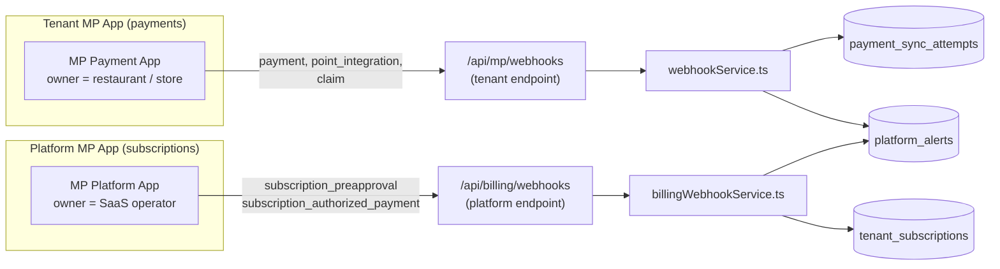
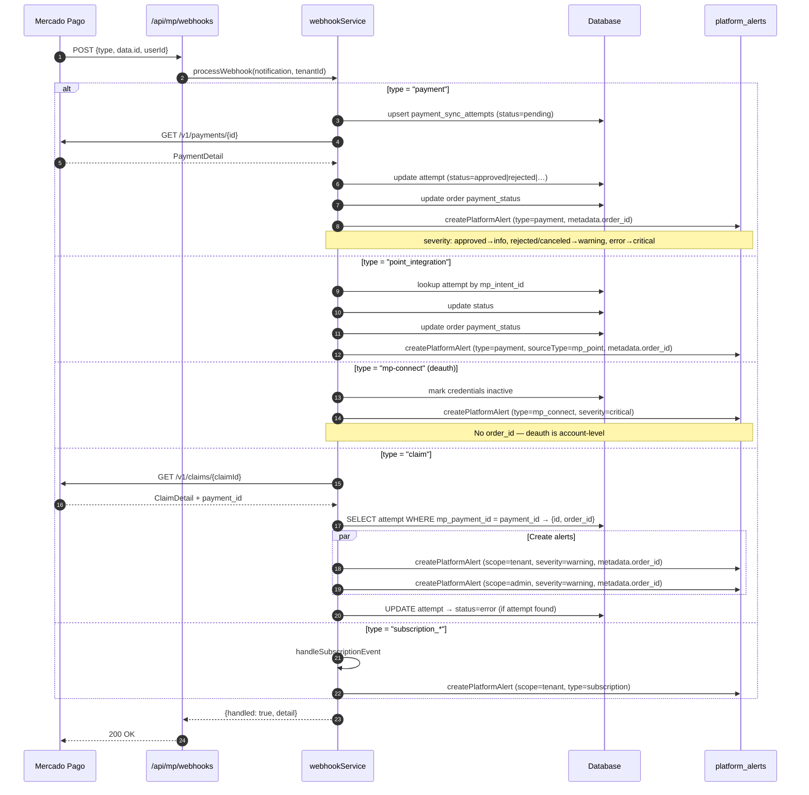
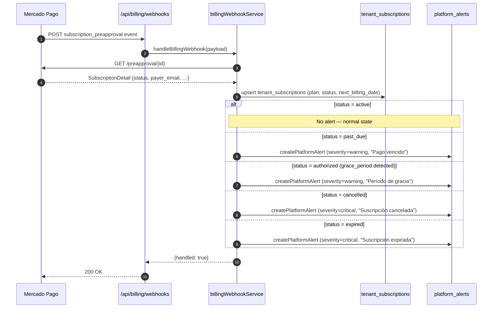
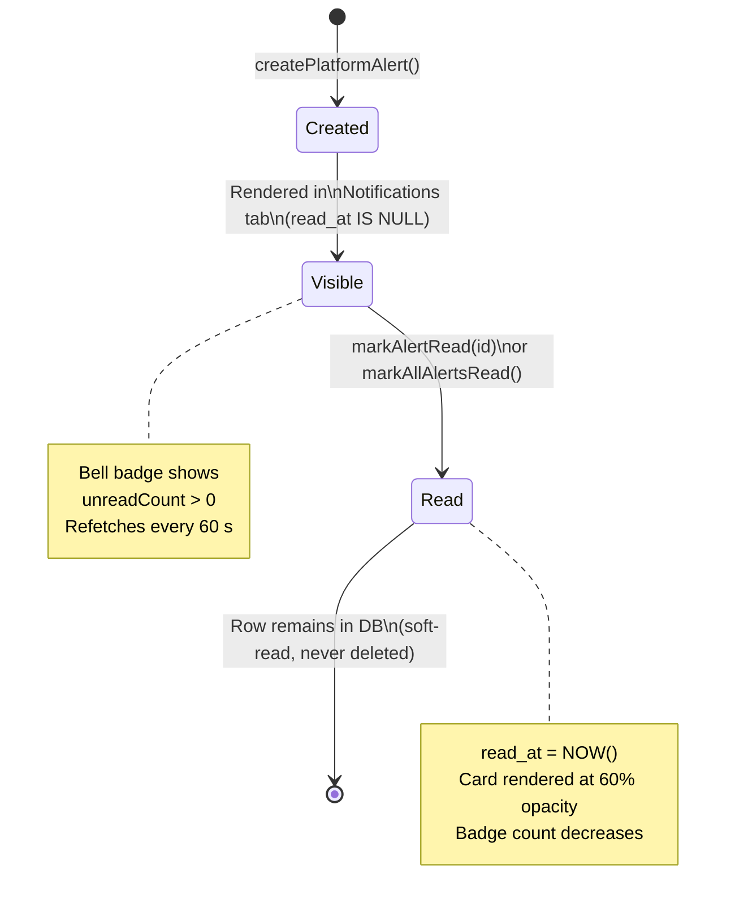
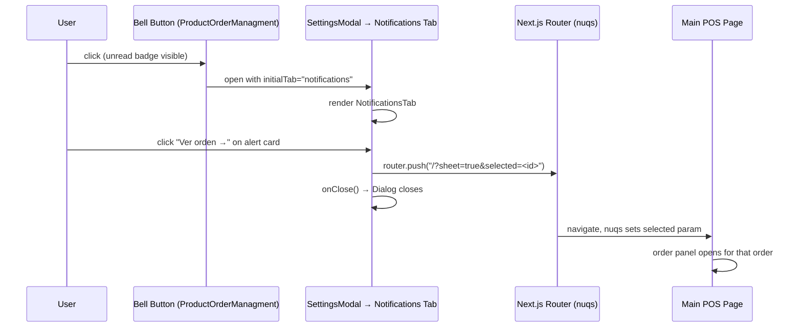
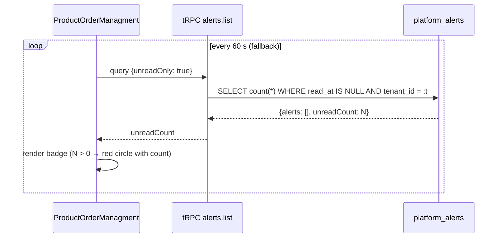
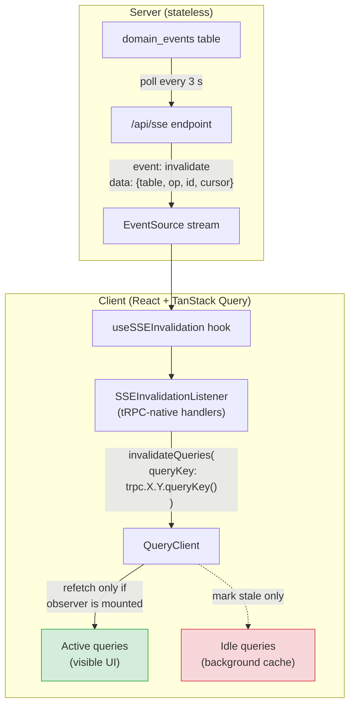
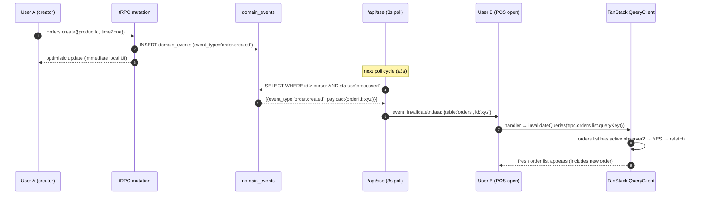

# Alerts & Webhook Flows

This document visualises the two distinct Mercado Pago webhook pipelines and how
they both funnel into the `platform_alerts` table, which powers the in-app
Notifications tab.

---

## 1 — Two-App MercadoPago Architecture

Every tenant configures **two separate MP applications**:



---

## 2 — Payment & Claim Webhook Flow (Tenant App)



---

## 3 — Billing Webhook Flow (Platform App → Tenant Subscriptions)



---

## 3b — Alert Type Coverage Matrix

Every webhook event type that creates a platform alert, the alert `type`
used, and whether `metadata.order_id` is present (enabling the "Ver orden →"
deep-link button in the Notifications tab).

| Webhook type | Handler | Alert `type` | `sourceType` | `metadata.order_id` | Deep-link? |
|---|---|---|---|---|---|
| `payment` | `handlePaymentEvent` | `payment` | `mp_payment` | ✅ from `external_reference` | ✅ |
| `point_integration_wh` / `order` | `handlePointIntegrationEvent` | `payment` | `mp_point` | ✅ from `attempt.order_id` | ✅ |
| `mp-connect` (deauth) | `handleMpConnectEvent` | `mp_connect` | `mp_connect` | ❌ account-level | ❌ |
| `claim` | `handleClaimEvent` | `claim` | `mp_claim` | ✅ if attempt found | ✅ conditional |
| `subscription_*` | `handleSubscriptionEvent` | `subscription` | `mp_subscription` | ❌ | ❌ |
| billing webhook | `billingWebhookService` | `subscription` | `mp_billing` | ❌ | ❌ |

### Multiple payments per order

A single order can have **many** payment attempts (retry after rejection,
split payments, etc.). Each webhook creates its own alert row. The alert
title includes the first 8 characters of the `orderId` for scannability:
`"Pago aprobado — orden a1b2c3d4"`. All alerts for the same order share
`metadata.order_id`, so the "Ver orden →" button always opens the correct
order detail panel.

### Alert severity mapping (payment events)

| Sync status | Severity | Rationale |
|---|---|---|
| `approved` | `info` | Normal — payment succeeded |
| `rejected` | `warning` | Actionable — tenant can retry |
| `canceled` | `warning` | Actionable — tenant can start new payment |
| `error` | `critical` | Requires investigation |
| _other_ | `info` | Default — intermediate states |

---

## 4 — Platform Alert Lifecycle



---

## 5 — Alert Deep-Link Navigation

When an alert has `metadata.order_id`, the Notifications tab renders a
**"Ver orden →"** button.  Clicking it:



---

## 6 — Unread Badge Polling

> **Note:** The 60-second polling is now a **fallback only**.  
> Real-time invalidation is handled via SSE (see section 7 below).  
> The `refetchInterval: 60_000` acts as a safety net in case the SSE
> connection drops or the browser tab was backgrounded.



---

## 7 — SSE Real-Time Invalidation Architecture

### Why the server stays stateless (no client params on `/api/sse`)

The SSE endpoint **does NOT** receive the client's current URL / nuqs params.
This is intentional — the architecture relies on **server-emitted lightweight
events** and **client-side TanStack Query intelligence** to decide what to
refetch.

#### Considered & rejected: `/api/sse?selected=X&date=Y&sheet=true`

| Problem | Detail |
|---------|--------|
| **EventSource is read-only** | The browser `EventSource` API sets URL params **only at connection time**. Every time `?selected` or `?date` changes (nuqs writes to the URL bar), we'd need to **close and reconnect** — killing the event stream and introducing latency spikes. |
| **Multi-tab / multi-user** | Each tab and each user has different params. The server would need per-connection state tracking — session affinity, connection maps, cleanup timers — all for marginal gain. |
| **TanStack Query already filters for free** | `queryClient.invalidateQueries()` only triggers a **network refetch for active queries** (those with a mounted React `useQuery` observer). Inactive/stale cache entries are just marked stale; they refetch lazily when the component using them next mounts. Zero wasted bandwidth. |

#### How it actually works: stateless server, smart client



### How nuqs params map to invalidation scope

The user's current view is encoded in URL query params managed by `nuqs`.
Each param feeds into a tRPC query's `input`, which becomes part of the
TanStack Query cache key. The SSE system doesn't need to know these params
because it uses **path-only prefix matching**, and TanStack Query only
refetches queries that have an active observer.

| nuqs param | tRPC query affected | SSE table trigger | Active? |
|------------|--------------------|--------------------|---------|
| `?selected=a,b` | `orders.getDetails({id})` for each | Same as above | ✅ Only the mounted detail |
| `?date=2026-02-24` | `orders.list({date, timeZone, status})` | `orders` | ✅ Always mounted on POS |
| `?sheet=true` | `orders.list(...)` (history sheet) | `orders` | ✅ Only while sheet is open |
| _(none — POS default)_ | `products.list`, `extras.list`, `alerts.list({unreadOnly})` | `products`, `extras`, `platform_alerts` | ✅ Always mounted |

### tRPC v11 query key format & why `TABLE_INVALIDATION_MAP` needed fixing

tRPC v11 (`@trpc/tanstack-react-query`) stores query keys as:

```
[["path", "segment"], { input: {...}, type: "query" }]
 ↑ nested array         ↑ second element
```

`TABLE_INVALIDATION_MAP` originally stored flat string arrays:
```ts
["orders", "list"]  // ← first element is "orders" (string)
```

TanStack Query v5 `partialDeepEqual` compares index by index:
```
filter[0] = "orders"          (string)
stored[0] = ["orders","list"] (array)
→ type mismatch → false → NEVER matches
```

**Fix:** `SSEInvalidationListener` uses `trpc.X.Y.queryKey()` which returns:
```ts
[["orders", "list"]]  // ← type="any", no input → path-only prefix
```

Now `partialDeepEqual` works:
```
filter[0] = ["orders","list"] (array)
stored[0] = ["orders","list"] (array)
→ deep equal → ✓ matches ALL orders.list queries regardless of their input
```

### Surgical order-detail invalidation

For order-related tables, the SSE payload carries `event.id` = the affected
row's `orderId` (parsed from `domain_events.payload`). The handler uses this
to invalidate only the specific detail query, not every prefetched detail:

```ts
// SSEInvalidationListener.tsx
orders: (_, event) => {
  // Bust ALL orders.list variants (every date/status combo)
  queryClient.invalidateQueries({ queryKey: trpc.orders.list.queryKey() });
  // Bust ONLY the specific order detail (if the user has it open)
  if (event.id) {
    queryClient.invalidateQueries({
      queryKey: trpc.orders.getDetails.queryKey({ id: event.id }),
    });
  }
},
```

### Complete table → tRPC query mapping

| SSE `table` | tRPC queries invalidated | Surgical? |
|-------------|--------------------------|-----------|
| `orders` | `orders.list.*`, `orders.getDetails({id})` | ✅ by `event.id` |
| `order_items` | `orders.list.*`, `orders.getDetails({id})` | ✅ by `event.id` |
| `order_item_extras` | `orders.list.*`, `orders.getDetails({id})` | ✅ by `event.id` |
| `products` | `products.list.*`, `products.export.*` | prefix (all) |
| `product_consumptions` | `products.consumptions.list.*` | prefix (all) |
| `extras` | `extras.list.*` | prefix (all) |
| `inventory_items` | `inventory.items.list.*`, `inventory.items.lowStock.*` | prefix (all) |
| `categories` | `inventory.categories.list.*` | prefix (all) |
| `transactions` | `inventory.transactions.list.*`, `.dailyGastos.*`, `.byDate.*` | prefix (all) |
| `platform_alerts` | `alerts.list.*`, `alerts.adminList.*` | prefix (all) |

### Complete domain event → SSE table routing

| Domain event | SSE tables | Notes |
|--------------|-----------|-------|
| `order.created` | `orders` | |
| `order.item.updated` | `orders`, `order_items` | |
| `order.split` | `orders`, `order_items` | |
| `order.combined` | `orders`, `order_items` | |
| `order.closed` | `orders` | |
| `order.opened` | `orders` | |
| `order.payment.toggled` | `orders`, `order_items` | Summary totals change |
| `order.payment.set` | `orders`, `order_items` | Batch payment assignment |
| `order.takeaway.toggled` | `orders`, `order_items` | |
| `order.products.removed` | `orders`, `order_items` | |
| `order.batch.closed` | `orders`, `order_items` | End-of-day close |
| `product.upserted` | `products` | |
| `product.consumption.added` | `product_consumptions` | Ingredient links |
| `product.consumption.removed` | `product_consumptions` | |
| `extra.upserted` | `extras` | |
| `extra.deleted` | `extras` | |
| `order.item.extra.toggled` | `order_item_extras` | |
| `inventory.item.added` | `inventory_items` | |
| `inventory.item.toggled` | `inventory_items` | |
| `inventory.item.deleted` | `inventory_items` | |
| `inventory.transaction.upserted` | `transactions` | |
| `inventory.transaction.deleted` | `transactions` | |
| `inventory.eod.reconciled` | `inventory_items`, `transactions` | Cross-table |
| `inventory.category.upserted` | `categories` | |
| `inventory.category.deleted` | `categories` | |
| `inventory.category.item.toggled` | `categories`, `inventory_items` | |
| `platform_alert.created` | `platform_alerts` | |

### Intentionally excluded from SSE

These event types emit domain_events but do **not** need SSE-triggered
client refreshes (they are admin-only, session-scoped, or have their own
refresh mechanism):

| Domain event | Reason |
|--------------|--------|
| `admin.audit.logged` | Admin audit trail — not user-facing |
| `order.payment.mercadopago.start` | MP payment modal has its own `attempt` polling query |
| `mercadopago.credentials.upserted` | Settings screen refetches on mutation `onSuccess` |

### Event flow end-to-end (example: new order created)


