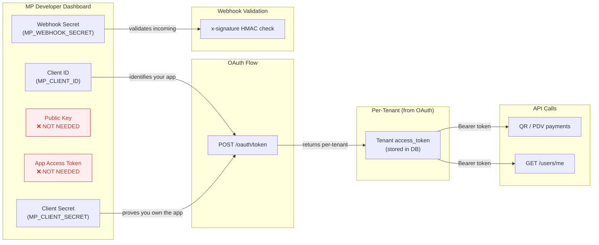
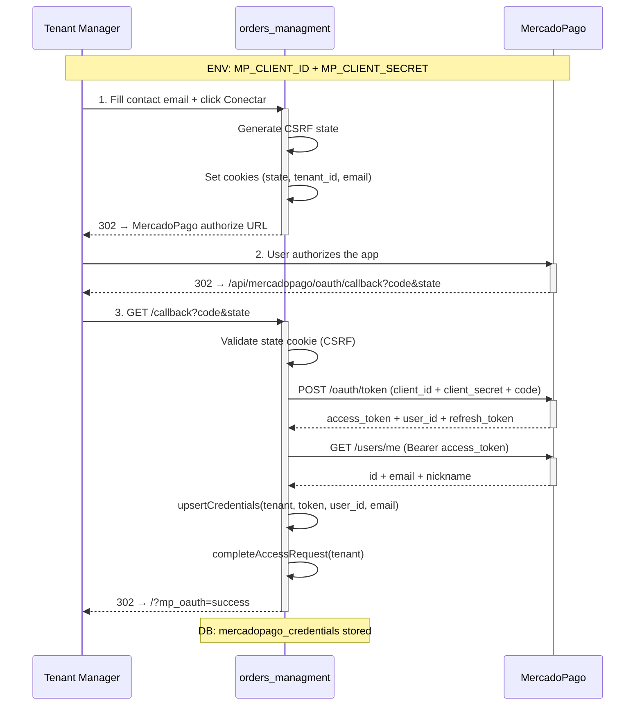
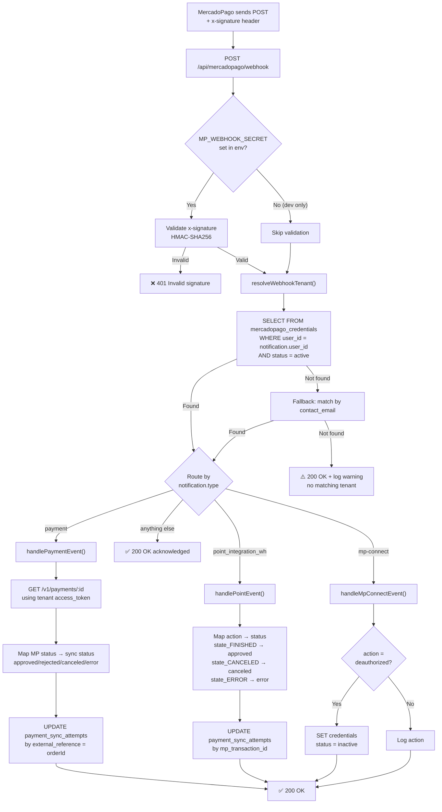
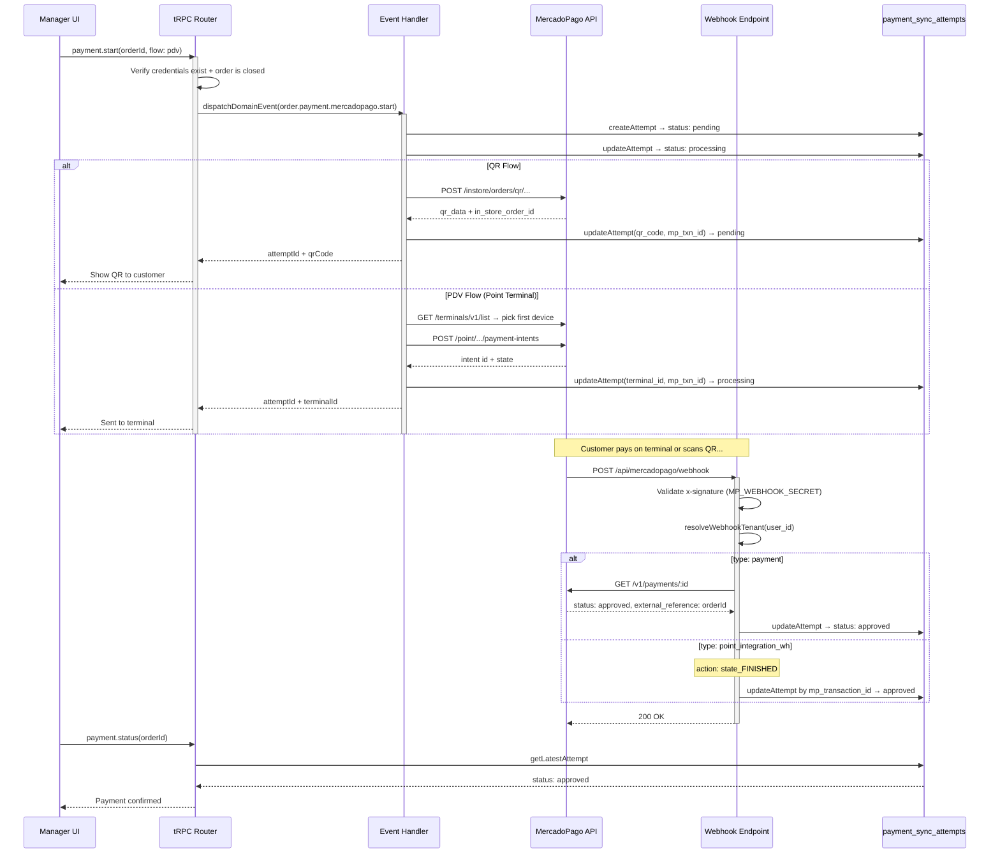
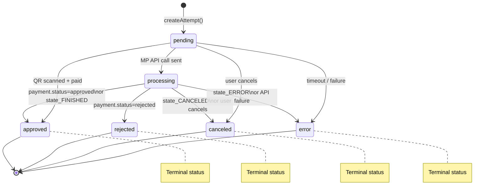
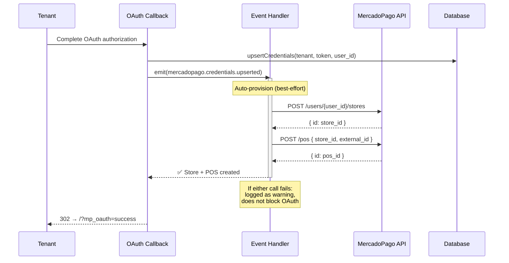
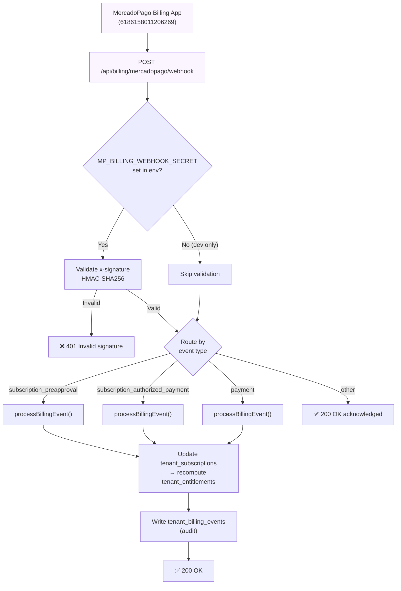

# MercadoPago Integration — Visual Diagrams

> **Tip:** GitHub renders Mermaid natively. In VS Code install the "Markdown Preview Mermaid Support" extension.

See also:

- [Mercado Pago Platform + Tenant Architecture](./MERCADOPAGO_PLATFORM_TENANT_ARCHITECTURE.md)
- [MercadoPago OAuth Integration](./MERCADOPAGO_OAUTH.md)
- [Entitlement Architecture](./MERCADOPAGO_ENTITLEMENT_ARCHITECTURE.md)
- [Approach — Payment & Billing](./MERCADOPAGO_APPROACH.md)
- [Planned Process (Visual Guide)](./MERCADOPAGO_PLANNED_PROCESS.md)

## Mercado Pago Docs Retrieval Convention

For external Mercado Pago documentation references used by this project, prefer markdown-compatible URLs by appending `.md` to the docs path.

- Default format: `https://www.mercadopago.com.br/developers/pt/docs/<topic>.md`
- Fallback format: original HTML docs URL when `.md` is not available.

Examples:

- `https://www.mercadopago.com.br/developers/pt/docs/checkout-api-orders/create-application.md`
- `https://www.mercadopago.com.br/developers/pt/docs/checkout-api-orders/payment-integration.md`

---

## 0. Two-App Architecture Overview

The platform uses **two independent MercadoPago applications** with separate credentials, webhook URLs, and purposes. Tenant payments (App 1) are gated by an active billing subscription (App 2).

```mermaid
flowchart TB
    subgraph app1["App 1 — MP-Point (2318642168506769)"]
        direction TB
        A1_PURPOSE["Purpose: Tenant collects<br/>in-person payments from<br/>their customers"]
        A1_CREDS["Credentials:<br/>MP_CLIENT_ID<br/>MP_CLIENT_SECRET"]
        A1_WH["Webhook URL:<br/>/api/mercadopago/webhook"]
        A1_EVENTS["Events: payment,<br/>point_integration_wh,<br/>mp-connect, order"]
        A1_OAUTH["OAuth per tenant → per-tenant<br/>access_token + user_id"]
    end

    subgraph app2["App 2 — Billing (6186158011206269)"]
        direction TB
        A2_PURPOSE["Purpose: Platform charges<br/>tenants a subscription fee<br/>to unlock MP features"]
        A2_CREDS["Credentials:<br/>MP_BILLING_CLIENT_ID<br/>MP_BILLING_CLIENT_SECRET"]
        A2_WH["Webhook URL:<br/>/api/billing/mercadopago/webhook"]
        A2_EVENTS["Events: subscription_preapproval,<br/>subscription_authorized_payment,<br/>payment, mp-connect"]
    end

    subgraph chain["Dependency Chain"]
        direction LR
        SUB["Tenant subscribes<br/>(App 2)"]
        ENT["Entitlement<br/>becomes active"]
        OAUTH["Tenant connects<br/>OAuth (App 1)"]
        PROV["Store + POS<br/>auto-provisioned"]
        PAY["Tenant can charge<br/>customers (QR/PDV)"]
        SUB --> ENT --> OAUTH --> PROV --> PAY
    end

    app2 -.->|"subscription webhook<br/>activates entitlement"| chain
    app1 -.->|"OAuth callback<br/>triggers auto-provision"| chain

    style app1 fill:#eff6ff,stroke:#3b82f6
    style app2 fill:#faf5ff,stroke:#8b5cf6
    style chain fill:#f0fdf4,stroke:#22c55e
```



### Credential Isolation

| | App 1 (Point — Payments) | App 2 (Billing — Subscriptions) |
|---|---|---|
| **MP App ID** | `2318642168506769` | `6186158011206269` |
| **Purpose** | Tenant charges their customers | Platform charges tenants |
| **Credential type** | OAuth per-tenant (`access_token`) | Platform-level (`MP_BILLING_*`) |
| **Webhook URL** | `/api/mercadopago/webhook` | `/api/billing/mercadopago/webhook` |
| **Webhook secret** | `MP_WEBHOOK_SECRET` | `MP_BILLING_WEBHOOK_SECRET` |
| **Key events** | `payment`, `point_integration_wh`, `mp-connect` | `subscription_preapproval`, `subscription_authorized_payment` |
| **Auto-provisioning** | Store + POS created on OAuth connect | N/A |

---

## 1. Environment Variables — What Each Secret Does



**Summary:**

| Env var | Source | Purpose |
|---------|--------|---------|
| `MP_CLIENT_ID` | MP dashboard → Your App | Identifies your app during OAuth |
| `MP_CLIENT_SECRET` | MP dashboard → Your App | Proves app ownership during code→token exchange |
| `MP_WEBHOOK_SECRET` | MP dashboard → Webhooks config | Validates `x-signature` HMAC on incoming webhooks |
| `MP_REDIRECT_URI` | You define it | Shared path for OAuth callback + webhook (`/api/mercadopago/webhook`) |
| `MP_REDIRECT_TEST_URI` | You define it | Sandbox/test webhook path (`/api/mercadopago/webhook/test`) |
| Public Key | MP dashboard | ❌ Only for client-side JS SDK — **not needed** |
| App Access Token | MP dashboard | ❌ Per-tenant tokens come from OAuth — **not needed** |

---

## 2. OAuth Flow — Tenant Onboarding



**Key points:**
- `MP_CLIENT_SECRET` is used **once** — server-side POST to `/oauth/token`
- Each tenant gets their **own** `access_token` — stored in `mercadopago_credentials`
- `user_id` (MP account ID) is how we link webhooks back to the tenant later

---

## 3. Webhook Pipeline — Tenant Resolution & Event Routing



**Tenant resolution chain:**
1. Primary: `mercadopago_credentials.user_id` = `notification.user_id` (MP account owner)
2. Fallback: `mercadopago_credentials.contact_email` (human-readable secondary match)
3. No match: Return 200 anyway (prevent infinite MP retries) + log warning

---

## 4. Payment Flow — QR / PDV End-to-End



---

## 5. Payment Sync Attempt — State Machine



---

## 6. Auto-Provisioning — Store + POS on OAuth Connect

When a tenant completes OAuth, the `mercadopago.credentials.upserted` event handler
automatically creates a Store and POS for the tenant on the MP API. This is a
homologation requirement — QR flow depends on a pre-registered POS with a valid
`external_pos_id`.



---

## 7. Billing Webhook Pipeline

Platform subscription events from App 2 (Billing) are handled on a separate
endpoint with independent HMAC validation.



---

## File Map

```
app/api/mercadopago/
├── oauth/
│   ├── authorize/route.ts   ← Initiates OAuth (uses MP_CLIENT_ID)
│   └── callback/route.ts    ← Handles callback (uses MP_CLIENT_SECRET)
├── webhook/
│   ├── route.ts             ← Production webhooks (uses MP_WEBHOOK_SECRET)
│   └── test/route.ts        ← Sandbox webhooks (no signature check)

app/api/billing/mercadopago/
└── webhook/
    ├── route.ts             ← Billing webhooks (uses MP_BILLING_WEBHOOK_SECRET)
    └── test/route.ts        ← Billing sandbox webhooks

lib/services/mercadopago/
├── mpFetch.ts               ← Shared HTTP helper (Bearer auth, B4 headers)
├── oauthService.ts          ← OAuth helpers (authorize URL, token exchange)
├── credentialsService.ts    ← CRUD mercadopago_credentials table
├── accessRequestsService.ts ← Track pending OAuth access requests
├── paymentService.ts        ← MP API: QR + PDV payment intents + device mode
├── storeService.ts          ← Store/Branch CRUD (homologation A1)
├── posService.ts            ← POS CRUD (homologation A2)
├── refundService.ts         ← Full + partial refund API
├── statusService.ts         ← CRUD payment_sync_attempts table
├── webhookService.ts        ← Webhook: signature, tenant resolver, handlers
└── tokenCrypto.ts           ← AES-256-GCM token encryption at rest

lib/events/
├── contracts.ts             ← Domain event types (incl. store, pos, refund, device)
└── handlers.ts              ← Event handlers (incl. auto-provision Store+POS)
```
