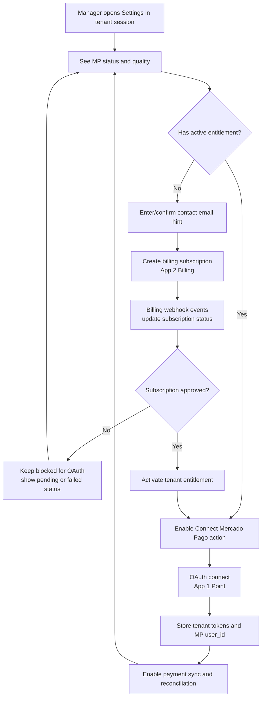
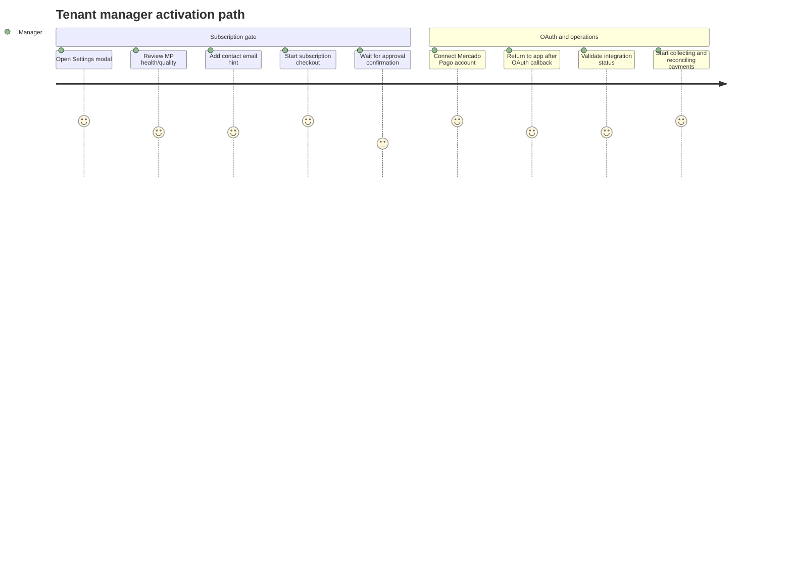
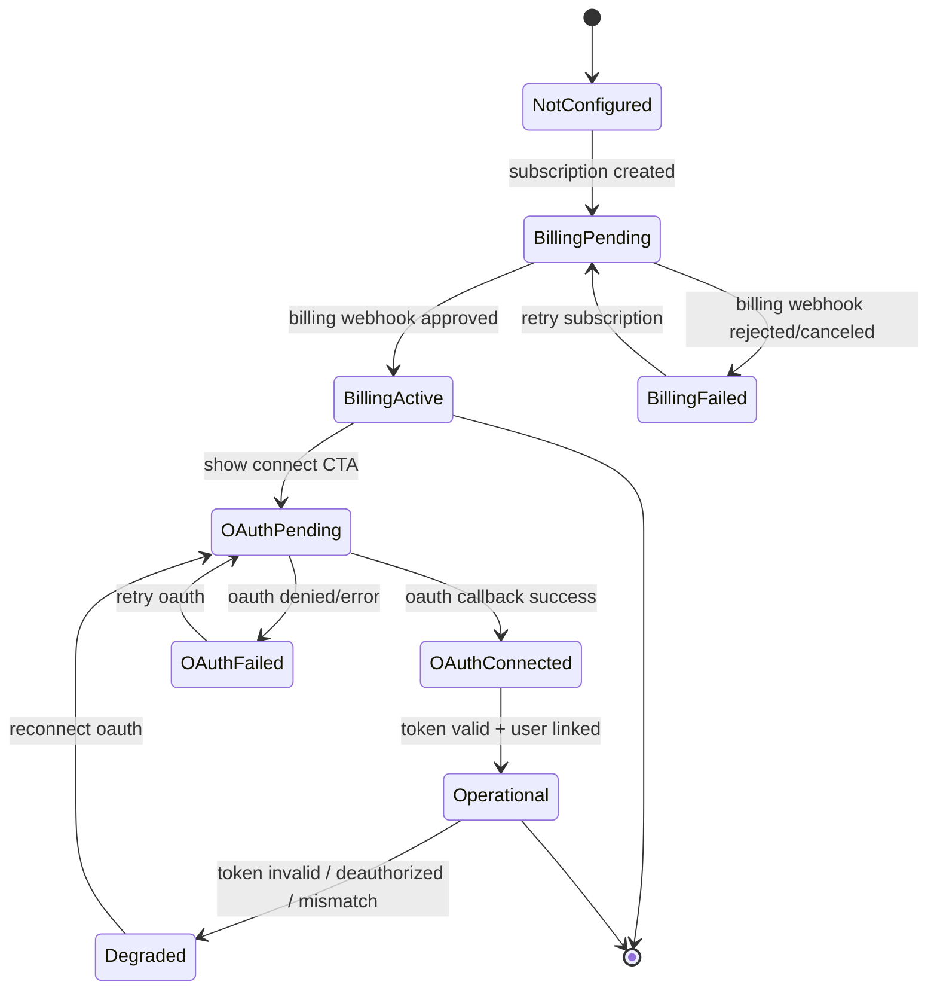
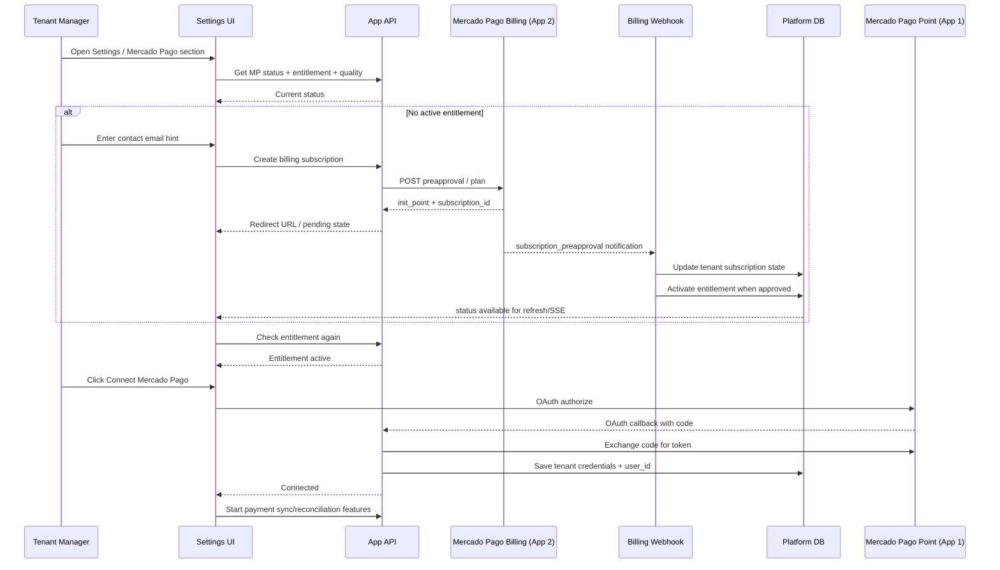
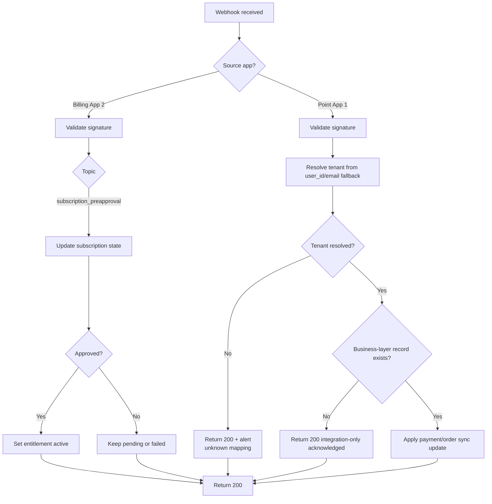
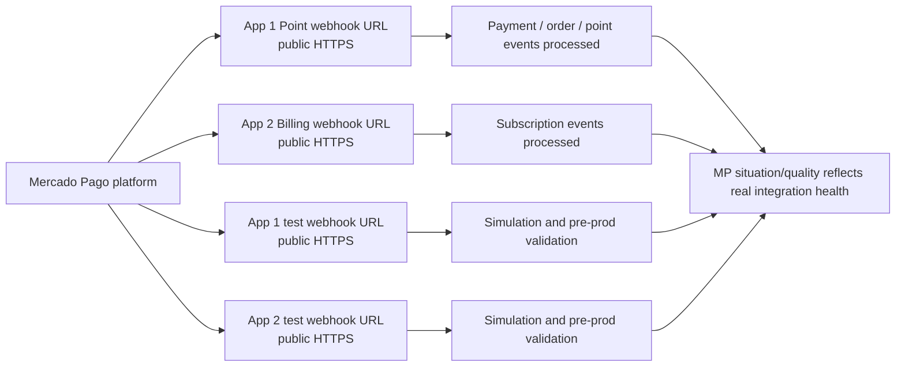

# Mercado Pago — Planned Process (Visual Guide)

This document explains the **planned target flow** in a visual-first way.

Scope covered:
- Manager journey from tenant session
- Subscription-first entitlement gating
- OAuth connect after entitlement activation
- Webhook-driven lifecycle updates
- Integration-only fallback behavior before business-layer data exists

---

## 1) Big Picture — What happens first

---

## 2) User Journey — Manager perspective

---

## 3) State Model — Tenant MP activation lifecycle

---

## 4) Sequence — Subscription first, then OAuth

---

## 5) Webhook decisions — expected behavior

---

## 6) Implementation checkpoints (planned)

1. **Settings first**: show status/quality and required email hint UX in tenant session.
2. **Subscription gate**: block OAuth until entitlement becomes active.
3. **Webhook source of truth**: entitlement activation only from approved billing webhook state.
4. **OAuth after entitlement**: connect Point app and persist tenant credentials.
5. **Operational resilience**: continue returning `200` for integration-only Point events while alerting unresolved tenant mappings.

---

## 7) Public availability requirement (production + test)

For Mercado Pago “situation/quality” and webhook processing to work as expected in production stage:

- Both MP apps must point to **public HTTPS** webhook URLs.
- Both environments must be reachable from Mercado Pago infrastructure:
    - production callback (`callback`)
    - test/sandbox callback (`callback_sandbox`)
- Test routes are not optional during hardening; they must also be publicly reachable for reliable simulation and validation.

### Availability checklist

| Integration | Production webhook (public) | Test webhook (public) | Required for MP health |
|---|---|---|---|
| App 1 — Point | ✅ Required | ✅ Required | ✅ Yes |
| App 2 — Billing | ✅ Required | ✅ Required | ✅ Yes |

If any of these four endpoints is private, blocked, or not routable, Mercado Pago validation/simulations become inconsistent and production-readiness is not guaranteed.

---

## Notes

- Billing ownership is system/platform-level, while activation is applied to the tenant entitlement lifecycle.
- Tenant manager flow remains tenant-session based for UX and status visibility.
- The diagrams represent target behavior for rollout validation and hardening.
