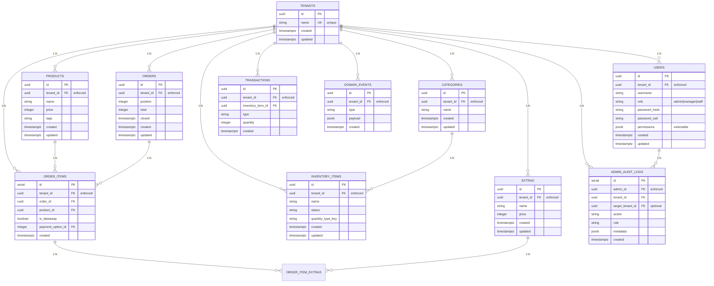

# RBAC + Tenant Scoping Architecture

> **Core Concept**: Every user belongs to exactly one **tenant** (business). Every business entity (orders, products, inventory) is isolated by `tenant_id`. tRPC procedures enforce both authentication and tenant-scoping automatically.

---

## 1. Database Schema & Multi-Tenancy

### Entity-Relationship Diagram



### Key Multi-Tenancy Constraints

| Table | tenant_id | Notes |
|-------|-----------|-------|
| **users** | `NOT NULL` FK → tenants(id) | Every user belongs to exactly one tenant |
| **products** | `NOT NULL` FK → tenants(id) | Products are tenant-scoped |
| **orders** | `NOT NULL` FK → tenants(id) | Orders belong to a tenant's business |
| **order_items** | `NOT NULL` FK → tenants(id) | Inherited from order's tenant |
| **categories** | `NOT NULL` FK → tenants(id) | Inventory categories per tenant |
| **inventory_items** | `NOT NULL` FK → tenants(id) | Stock levels per tenant |
| **transactions** | `NOT NULL` FK → tenants(id) | Transaction history per tenant |
| **extras** | `NOT NULL` FK → tenants(id) | Product add-ons per tenant |
| **domain_events** | `NOT NULL` FK → tenants(id) | Event log per tenant |
| **admin_audit_logs** | `NOT NULL` FK → tenants(id) | Audit trail per tenant |

---

## 2. RBAC: Role-Based Access Control

### Role Hierarchy

```mermaid
graph TD
    SUPER["🔐 Admin<br/>(API Key Only)<br/>Full System Access"]
    MANAGER["💼 Manager<br/>(Session + Tenant)<br/>Manage Products & Orders"]
    STAFF["👤 Staff<br/>(Session + Tenant)<br/>View & Create Orders"]
    
    SUPER -->|"Can manage"| MANAGER
    SUPER -->|"Can manage"| STAFF
    MANAGER -->|"Supervises"| STAFF
    
    SUPER -->|"Cross-tenant"| AUDIT["📋 Admin Audit Log Viewer<br/>(Can see cross-tenant activity)"]
    MANAGER -->|"Tenant-scoped"| ORDERS["Create/Update Orders"]
    MANAGER -->|"Tenant-scoped"| PRODUCTS["Manage Products"]
    STAFF -->|"Tenant-scoped"| ORDERS
    STAFF -->|"Read-only"| PRODUCTS

    style SUPER fill:#ff6b6b
    style MANAGER fill:#ffa500
    style STAFF fill:#51cf66
    style AUDIT fill:#4c6ef5
```



### Role Permissions Matrix

```mermaid
graph LR
    subgraph "Admin (API Key)"
        A1["✓ listTenants"]
        A2["✓ createTenant"]
        A3["✓ exportData"]
        A4["✓ importData"]
        A5["✓ listAuditLogs<br/>(cross-tenant)"]
        A6["✓ viewMigrations"]
    end

    subgraph "Manager (Tenant + Role)"
        M1["✓ Create Products"]
        M2["✓ Update Products"]
        M3["✓ Delete Products"]
        M4["✓ Bulk Import"]
        M5["✓ Manage Extras"]
        M6["✓ Close Orders"]
        M7["✓ Manage Inventory Items"]
        M8["✓ Manage Categories"]
        M9["✓ Batch Close Orders"]
        M10["✓ Product Compositions"]
    end

    subgraph "Staff (Tenant Only)"
        S1["✓ View/Create Orders"]
        S2["✓ Update Order Items"]
        S3["✓ Add/Edit/Delete Transactions"]
        S4["✓ View Products"]
        S5["✓ View Inventory"]
        S6["✓ View Categories"]
    end

    style A1 fill:#ff6b6b
    style A2 fill:#ff6b6b
    style A3 fill:#ff6b6b
    style A4 fill:#ff6b6b
    style A5 fill:#ff6b6b
    style A6 fill:#ff6b6b
    style M1 fill:#ffa500
    style M2 fill:#ffa500
    style M3 fill:#ffa500
    style M4 fill:#ffa500
    style M5 fill:#ffa500
    style M6 fill:#ffa500
    style M7 fill:#ffa500
    style M8 fill:#ffa500
    style M9 fill:#ffa500
    style M10 fill:#ffa500
    style S1 fill:#51cf66
    style S2 fill:#51cf66
    style S3 fill:#51cf66
    style S4 fill:#51cf66
    style S5 fill:#51cf66
    style S6 fill:#51cf66
```



---

## 3. tRPC Procedure Hierarchy

### Protected Procedure Chain


### Procedure Implementation Details

```typescript
// Step 1: Public (No Protection)
publicProcedure
  // Anyone can call

// Step 2: Protected (Session Required)
protectedProcedure = publicProcedure.use(async ({ ctx, next }) => {
  if (!ctx.session) throw UNAUTHORIZED;
  return next({ ctx });
})
  // Requires valid sessionToken in cookies

// Step 3: Tenant-Scoped (Tenant ID Required)
tenantProcedure = protectedProcedure.use(({ ctx, next }) => {
  const tenantId = ctx.session?.tenant_id;
  if (!tenantId) throw UNAUTHORIZED;
  return next({ ctx: { ...ctx, tenantId } });
})
  // ctx.tenantId is extracted from session once
  // All queries automatically scoped to this tenant

// Step 4: Manager-Only (Role Check)
managerProcedure = tenantProcedure.use(({ ctx, next }) => {
  const role = parseUserRole(ctx.session?.role);
  if (role !== "manager" && role !== "admin") throw FORBIDDEN;
  return next({ ctx });
})
  // Requires role = "manager" or "admin"
  // Plus all tenantProcedure protections

// Step 5: Admin (API Key Only)
adminProcedure = t.procedure.use(async ({ ctx, next }) => {
  if (!ctx.isAdmin) throw UNAUTHORIZED;
  return next({ ctx });
})
  // Requires x-admin-key header = ADMIN_SECRET
  // Bypasses session/tenant checks (cross-tenant)
```

---

## 4. Request Flow: From Client to Database

### Tenant-Scoped Request (Staff viewing orders)


### Cross-Tenant Admin Request (View audit logs)


### Unauthorized Access Attempt


---

## 5. Data Isolation: Database-Layer Enforcement

### Tenant Scoping Pattern in SQL Functions

Every query function follows this pattern:

```typescript
// Example: getOrders function
export async function getOrders(params: {
  tenantId: string;  // ← REQUIRED, passed from tRPC ctx
  timeZone: string;
  date?: string;
}) {
  return db
    .selectFrom("orders")
    .where("tenant_id", "=", params.tenantId)  // ← Enforced WHERE
    .where("deleted", "is", null)
    .selectAll()
    .orderBy("created", "desc")
    .execute();
}
```

### Multi-Layer Isolation


---

## 6. Admin Audit Logging: Cross-Tenant Activity

### Audit Log Flow


### Audit Log Entry Structure

```typescript
interface AdminAuditLog {
  id: number;                    // Auto-incrementing
  admin_id: string;              // UUID of admin
  role: string;                  // "admin" (always)
  action: string;                // "exportData", "createTenant", etc.
  tenant_id: string;             // Admin's own tenant
  target_tenant_id?: string;     // Tenant being operated on (null = system op)
  metadata?: Record<string>;     // Additional context (CSV rows, import count, etc.)
  created: Date;                 // ISO timestamp
}
```

### Audit Log Queries

```typescript
// Admin views all cross-tenant activity
const logs = await trpc.admin.listAuditLogs.query({
  admin_id: "uuid",              // Filter by admin
  action: "exportData",          // Filter by action type
  target_tenant_id: "tenant-id", // Filter by affected tenant
  limit: 100                     // Pagination
});

// Result: All logs matching filters (no tenant scoping)
// Storage: All logged in PG, queryable, auditable
```

---

## 7. Security Boundaries

### What's Impossible

| Scenario | Blocked By | Mechanism |
|----------|-----------|-----------|
| **Staff sees another tenant's orders** | tenantProcedure + WHERE clause | Session validates tenant_id, SQL filters by tenant_id |
| **Manager updates another tenant's products** | tenantProcedure + FK constraint | Can't insert with wrong tenant_id (FK violation) |
| **Unauthenticated user calls any data endpoint** | protectedProcedure | Session validation throws UNAUTHORIZED |
| **User calls admin endpoint without API key** | adminProcedure | Validates x-admin-key header |
| **Admin circumvents audit logging** | Domain events + handler | All admin.* calls dispatch events automatically |
| **Direct DB query bypasses tenant scoping** | Client auth required | Can't execute raw SQL from browser; must use tRPC |

### What IS Possible (By Design)

| Scenario | Reason | Security Impact |
|----------|--------|-----------------|
| **Admin views any tenant's audit logs** | Cross-tenant read for compliance | ✓ Acceptable (admins are trusted) |
| **Manager creates orders for their tenant** | Role + tenant scoping | ✓ Expected (limited to their tenant) |
| **Staff views shared resources (e.g., products)** | Shared within tenant | ✓ Expected (shared business data) |
| **Admin exports all data** | API key authenticated, audited | ⚠️ Powerful but logged |

---

## 8. Session Token Structure

### JWT Claims (SessionPayload)

```typescript
interface SessionPayload {
  sub: string;                  // User ID (UUID)
  tenant_id: string;            // ← Core isolation claim
  tenant_name?: string;         // Display name (optional)
  role: "admin" | "manager" | "staff";
  iat: number;                  // Issued at (seconds)
  exp: number;                  // Expires at (seconds)
}
```

### Token Creation Flow


---

## 9. Typical API Call Patterns

### Pattern: List orders for current tenant

```typescript
// Frontend
const orders = await trpc.orders.list.query({
  timeZone: "America/Mexico_City",
});

// Backend execution
tenantProcedure.query(async ({ ctx, input }) => {
  //                           ↓
  //              ctx.tenantId = "tenant-uuid" (from session)
  //              ctx.session = { sub, tenant_id, role, ... }
  
  return getOrders({
    tenantId: ctx.tenantId,  // ← Auto-scoped
    timeZone: input.timeZone,
  });
});

// Database query (automatically scoped)
// SELECT * FROM orders WHERE tenant_id = $1 AND ...
// Parameters: [ctx.tenantId]

// Result: Only orders from user's tenant
```

### Pattern: Create product (manager only)

```typescript
// Frontend
const product = await trpc.products.create.mutation({
  name: "Croissant",
  price: 450,
  tags: ["pastry"],
});

// Backend execution
managerProcedure
  .input(CreateProductInput)
  .mutation(async ({ ctx, input }) => {
    //
    // Validations:
    // 1. ctx.session exists (protectedProcedure)
    // 2. ctx.tenantId exists (tenantProcedure)
    // 3. ctx.session.role in ["manager", "admin"] (managerProcedure)
    //
    
    return upsertProduct({
      tenantId: ctx.tenantId,  // ← Forced to current tenant
      ...input,
    });
  });

// Database insert
// INSERT INTO products (id, tenant_id, name, price, tags, ...)
// VALUES (..., $tenantId, ...) 
// FK constraint enforces tenant_id = $tenantId
```

### Pattern: Export all data (admin only)

```typescript
// Frontend (internal admin tool)
const allData = await trpc.admin.exportData.query();

// Backend execution
adminProcedure.query(async ({ ctx }) => {
  //
  // Validation:
  // 1. ctx.isAdmin = true (from x-admin-key header)
  // 2. No session/tenant requirement
  //
  
  // Log the action (cross-tenant audit)
  await logAdminAccess({
    action: "exportData",
    adminId: ctx.session?.sub,  // Can be null for API-key-only calls
    tenantId: ctx.session?.tenant_id,
    metadata: { exportTime, rowCount },
  });
  
  // Export everything (no tenant filter)
  return exportAllData();
});

// Database export (NO WHERE clause for tenant_id)
// SELECT * FROM products, orders, ...
// Result: Full database snapshot, logged in admin_audit_logs
```

### Pattern: Manage inventory items (manager only)

```typescript
// Frontend
const items = await trpc.inventory.items.list.query({
  categoryId: "uuid-optional", // Optional category filter
});

// Backend execution
tenantProcedure.query(async ({ ctx, input }) => {
  //
  // Validations:
  // 1. ctx.session exists (protectedProcedure)
  // 2. ctx.tenantId exists (tenantProcedure)
  //
  
  return getItems({
    tenantId: ctx.tenantId,      // ← Auto-scoped
    categoryId: input?.categoryId,
  });
});

// Database query with category check
// SELECT *, EXISTS(
//   SELECT 1 FROM category_inventory_item
//   WHERE item_id = inventory_items.id
//     AND tenant_id = $tenantId
// ) AS hasCategory
// FROM inventory_items
// WHERE tenant_id = $tenantId
// Result: Only items from user's tenant

// Add inventory item (manager only)
await trpc.inventory.items.add.mutation({
  name: "Harina de trigo",
  quantityTypeKey: "kg",
  categoryId: "uuid-optional",
});
// Requires managerProcedure (role check + tenant scoping)
// Emits domain event: "inventory.item.added"

// Upsert transaction (any tenant user — staff or manager)
await trpc.inventory.transactions.upsert.mutation({
  itemId: "item-uuid",
  type: "IN",  // or "OUT"
  quantity: 25,
  price: 45000, // in cents
  quantityTypeValue: "kg",
  // id: 42,  // ← include id to UPDATE existing, omit to INSERT new
});
// Requires tenantProcedure (any authenticated tenant member)
// Emits domain event: "inventory.transaction.upserted"
// SQL: INSERT when no id, UPDATE when id present (upsertTransaction)
```

### Pattern: Manage inventory categories (manager only)

```typescript
// List categories (staff can view)
const categories = await trpc.inventory.categories.list.query();
// Uses tenantProcedure (view access for all roles)

// Create/update category (manager only)
await trpc.inventory.categories.upsert.mutation({
  id: "uuid-optional", // Omit for new category
  name: "Ingredientes secos",
});
// Requires managerProcedure
// Emits domain event: "inventory.category.upserted"

// Toggle item in category (manager only)
await trpc.inventory.categories.toggleItem.mutation({
  categoryId: "category-uuid",
  itemId: "item-uuid",
});
// Adds or removes association in category_inventory_item table
// Requires managerProcedure
// Emits domain event: "inventory.category.item.toggled"
```

---

## 10. Inventory Management: RBAC & Event-Driven Architecture

### Inventory Module Overview

The inventory system manages stock items, categories, and transactions with full tenant scoping and event-driven architecture. All mutations emit domain events for auditability and future extensibility (e.g., low-stock alerts, category suggestions).

### Inventory Tables & Relationships


### Inventory Endpoints: Permission Matrix

| Endpoint | Procedure | Role | Purpose |
|----------|-----------|------|---------|
| **inventory.items.list** | `tenantProcedure` | Staff, Manager | View all inventory items (optional category filter) |
| **inventory.items.add** | `managerProcedure` | Manager | Create new inventory item |
| **inventory.items.toggle** | `managerProcedure` | Manager | Toggle item status (pending ↔ completed) |
| **inventory.items.delete** | `managerProcedure` | Manager | Delete inventory item |
| **inventory.items.lowStock** | `tenantProcedure` | Staff, Manager | Get items below `min_stock` threshold |
| **inventory.transactions.list** | `tenantProcedure` | Staff, Manager | View transaction history for an item |
| **inventory.transactions.upsert** | `tenantProcedure` | Staff, Manager | Create or update IN/OUT transaction (gasto) |
| **inventory.transactions.delete** | `tenantProcedure` | Staff, Manager | Delete transaction record |
| **inventory.transactions.dailyGastos** | `tenantProcedure` | Staff, Manager | Aggregated IN transactions by date (grouped by item) |
| **inventory.transactions.byDate** | `tenantProcedure` | Staff, Manager | Individual IN transactions for a date (for edit/delete) |
| **inventory.categories.list** | `tenantProcedure` | Staff, Manager | View all categories |
| **inventory.categories.upsert** | `managerProcedure` | Manager | Create or update category |
| **inventory.categories.delete** | `managerProcedure` | Manager | Delete category |
| **inventory.categories.toggleItem** | `managerProcedure` | Manager | Add/remove item from category |

### Event-Driven Mutation Pattern

All inventory mutations follow the event-driven pattern:

```typescript
// 1. tRPC mutation receives input
managerProcedure
  .input(AddItemSchema)
  .mutation(async ({ ctx, input }) => {
    // 2. Dispatch domain event (not direct DB call)
    return dispatchDomainEvent({
      type: "inventory.item.added",
      payload: { tenantId: ctx.tenantId, ...input },
    });
  });

// 3. Event handler processes the event
eventBus.on("inventory.item.added", async (event) => {
  // 4. Execute DB operation
  const item = await addItem(event.payload);
  
  // 5. Handle category association if provided
  if (event.payload.categoryId) {
    await toggleCategoryItem({
      tenantId: event.payload.tenantId,
      categoryId: event.payload.categoryId,
      itemId: item.id,
    });
  }
});
```

### Tenant Scoping in Inventory Queries

**Example: List items with category association check**

```typescript
export async function getItems(params: {
  tenantId: string;
  categoryId?: string;
}) {
  return await db
    .selectFrom('inventory_items')
    .select([
      'id', 'name', 'status', 'quantity_type_key',
      // Check if item has ANY category (avoids JOIN duplication)
      sql<boolean>`exists (
        select 1 from category_inventory_item as ci
        where ci.item_id = inventory_items.id
          and ci.tenant_id = ${params.tenantId}
      )`.as('hasCategory')
    ])
    .where('inventory_items.tenant_id', '=', params.tenantId)
    .$if(!!params.categoryId, (qb) =>
      // Filter by specific category if provided
      qb.where(sql`exists (
        select 1 from category_inventory_item as ci
        where ci.item_id = inventory_items.id
          and ci.tenant_id = ${params.tenantId}
          and ci.category_id = ${params.categoryId}
      )`)
    )
    .execute();
}
```

**Key Points:**
- Uses `EXISTS` subquery instead of `JOIN` to avoid row duplication
- Always filters by `tenant_id` at multiple layers (item, category association)
- Returns `hasCategory` flag for UI indicators (e.g., "Sin categoria" badge)

### Domain Events Emitted

| Event Type | Payload | Procedure | Trigger |
|------------|---------|-----------|---------|
| `inventory.item.added` | `{ tenantId, name, quantityTypeKey, categoryId? }` | `managerProcedure` | Manager adds item |
| `inventory.item.toggled` | `{ tenantId, id }` | `managerProcedure` | Manager toggles item status |
| `inventory.item.deleted` | `{ tenantId, id }` | `managerProcedure` | Manager deletes item |
| `inventory.transaction.upserted` | `{ tenantId, itemId, type, quantity, price, quantityTypeValue, id? }` | `tenantProcedure` | Any tenant user creates or edits transaction (gasto) |
| `inventory.transaction.deleted` | `{ tenantId, id }` | `tenantProcedure` | Any tenant user deletes transaction |
| `inventory.category.upserted` | `{ tenantId, id?, name }` | `managerProcedure` | Manager creates/updates category |
| `inventory.category.deleted` | `{ tenantId, id }` | `managerProcedure` | Manager deletes category |
| `inventory.category.item.toggled` | `{ tenantId, categoryId, itemId }` | `managerProcedure` | Manager adds/removes item from category |
| `inventory.eod.reconciled` | `{ tenantId, date }` | *(side-effect)* | Triggered by `order.batch.closed` handler |
| `order.batch.closed` | `{ tenantId, date, timeZone }` | `tenantProcedure` + runtime `requireRole(["manager","admin"])` | Manager batch-closes day's orders |
| `product.consumption.added` | `{ tenantId, productId, itemId, dimensionId, quantityRequired }` | `managerProcedure` | Manager adds ingredient to product |
| `product.consumption.removed` | `{ tenantId, productId, itemId }` | `managerProcedure` | Manager removes ingredient from product |

### UI Flow: Adding Inventory Item with Category


### Transaction Tracking

Transactions record inventory movements (IN = stock added, OUT = stock depleted).
The `upsertTransaction` SQL function handles both INSERT (new) and UPDATE (edit) via the optional `id` field:

```typescript
interface Transaction {
  id: number;                    // Auto-increment (serial)
  tenant_id: string;             // Tenant scoping
  item_id: string;               // FK to inventory_items
  type: "IN" | "OUT";            // Movement direction
  quantity: number;              // Amount moved
  price: number;                 // Cost in cents
  quantity_type_value: string;   // Unit (kg, L, units)
  created: Date;                 // ISO timestamp
}

// Upsert behavior:
// - No id → INSERT new transaction
// - id present → UPDATE item_id, quantity_type_value, price for existing row
```

**UI Features:**
- Transaction history with type filters (all/IN/OUT)
- Date range filtering (dateFrom/dateTo)
- Formatted display with badges, price, and date
- Any tenant user can add/edit/delete transactions (gastos)
- `ItemSelectorContent` reused for both add and edit flows
- Price input with `$` prefix, `MXN` suffix, Intl locale formatting

---

## 11. Architecture Summary


---

## 12. Key Files Reference

| File | Purpose | Key Code |
|------|---------|----------|
| **lib/trpc/init.ts** | Procedure definitions | `tenantProcedure`, `managerProcedure`, `adminProcedure` |
| **lib/auth/session.ts** | Token verification | `verifySessionToken()`, `SessionPayload` |
| **lib/auth/admin.ts** | Admin key validation | `hasAdminApiKey()`, `getAdminConfig()` |
| **lib/sql/database.ts** | Kysely setup | `db` instance, dialect config |
| **lib/sql/migrations.ts** | Schema + constraints | v4 (tenants/users), v6 (audit logs), v10 (product_consumptions), v11 (min_stock) |
| **lib/sql/functions/inventory.ts** | Inventory items queries | `getItems()`, `addItem()`, `toggleItem()`, `deleteItem()`, `getLowStockAlerts()` |
| **lib/sql/functions/categories.ts** | Category management | `getCategories()`, `upsertCategory()`, `toggleCategoryItem()` |
| **lib/sql/functions/transactions.ts** | Transaction tracking | `upsertTransaction()`, `deleteTransaction()`, `getTransactions()`, `getDailyGastos()`, `getGastosByDate()` |
| **lib/sql/functions/productConsumptions.ts** | Product composition | `getProductConsumptions()`, `addProductConsumption()`, `removeProductConsumption()` |
| **lib/sql/functions/closeOrder.ts** | EOD batch operations | `batchCloseOrders()`, `deductDayConsumptions()` |
| **lib/sql/functions/** | Scoped queries | `getOrders()`, `getProducts()`, etc. |
| **lib/trpc/routers/admin.ts** | Admin endpoints | `exportData`, `listAuditLogs`, etc. |
| **lib/trpc/routers/orders.ts** | Tenant endpoints | `list`, `create`, `update`, `batchClose` (all scoped) |
| **lib/trpc/routers/products.ts** | Product endpoints | `upsert`, `consumptions.*` (manager), `list`, `export` (tenant) |
| **lib/trpc/routers/inventory.ts** | Inventory endpoints | `items.*`, `transactions.*`, `categories.*` |
| **lib/trpc/routers/extras.ts** | Extras endpoints | `list`, `upsert`, `delete`, `toggleOnItem` |
| **lib/events/contracts.ts** | Event type definitions | `DomainEventType`, `DomainEventMap`, typed payloads |
| **lib/events/dispatch.ts** | Event emission | `dispatchDomainEvent()` |
| **lib/events/handlers.ts** | Event handlers | All domain event → SQL function mappings |
| **lib/utils/currency.ts** | Currency formatting | `parseCurrencyToCents()`, `centsToMxDisplay()` |
| **components/Inventory/ItemSelector.tsx** | Reusable item selector | `ItemSelectorContent` — search, create, details (qty/unit/price) |

---

## 13. RBAC × Domain Event Emissions Matrix

> **Complete mapping**: Every tRPC route that dispatches a domain event, its required access level, the event type, and the SQL function ultimately invoked.

### Access-Level Legend

| Color | Procedure | Access |
|-------|-----------|--------|
| 🟢 | `tenantProcedure` | Any authenticated tenant member (staff, manager, admin) |
| 🟠 | `managerProcedure` | Manager or admin role required |
| 🟡 | `tenantProcedure` + runtime `requireRole` | Tenant procedure with additional inline role guard |
| 🔴 | `adminProcedure` | Superadmin API key required |

### Orders Domain

| Route | Access | Event | Handler → SQL |
|-------|--------|-------|---------------|
| `orders.create` | 🟡 Staff+ | `order.created` + `order.item.updated` | `insertOrder()` + `updateOrderItem()` |
| `orders.updateItem` | 🟡 Staff+ | `order.item.updated` | `updateOrderItem()` |
| `orders.split` | 🟡 Staff+ | `order.split` | `splitOrder()` |
| `orders.combine` | 🟡 Staff+ | `order.combined` | `combineOrders()` |
| `orders.close` | 🟡 Staff+ | `order.closed` | `closeOrder()` |
| `orders.open` | 🟡 Staff+ | `order.opened` | `openOrder()` |
| `orders.togglePayment` | 🟡 Staff+ | `order.payment.toggled` | `togglePaymentOption()` |
| `orders.setPaymentOption` | 🟡 Staff+ | `order.payment.set` | `setPaymentOption()` |
| `orders.toggleTakeaway` | 🟡 Staff+ | `order.takeaway.toggled` | `toggleTakeAway()` |
| `orders.removeProducts` | 🟡 Staff+ | `order.products.removed` | `removeProducts()` |
| `orders.batchClose` | 🟡 Manager+ | `order.batch.closed` | `batchCloseOrders()` → `deductDayConsumptions()` |

### Inventory Domain

| Route | Access | Event | Handler → SQL |
|-------|--------|-------|---------------|
| `inventory.items.add` | 🟠 Manager | `inventory.item.added` | `addItem()` + optionally `toggleCategoryItem()` |
| `inventory.items.toggle` | 🟠 Manager | `inventory.item.toggled` | `toggleItem()` |
| `inventory.items.delete` | 🟠 Manager | `inventory.item.deleted` | `deleteItem()` |
| `inventory.transactions.upsert` | 🟢 Tenant | `inventory.transaction.upserted` | `upsertTransaction()` (INSERT or UPDATE) |
| `inventory.transactions.delete` | 🟢 Tenant | `inventory.transaction.deleted` | `deleteTransaction()` |
| `inventory.categories.upsert` | 🟠 Manager | `inventory.category.upserted` | `upsertCategory()` |
| `inventory.categories.delete` | 🟠 Manager | `inventory.category.deleted` | `deleteCategory()` |
| `inventory.categories.toggleItem` | 🟠 Manager | `inventory.category.item.toggled` | `toggleCategoryItem()` |

### Products Domain

| Route | Access | Event | Handler → SQL |
|-------|--------|-------|---------------|
| `products.upsert` | 🟠 Manager | `product.upserted` | `upsertProduct()` |
| `products.csvUpload` | 🟠 Manager | `product.upserted` × N | `upsertProduct()` (loop) |
| `products.resetAndImport` | 🟠 Manager | `product.upserted` × N | delete all → `upsertProduct()` (loop) |
| `products.consumptions.add` | 🟠 Manager | `product.consumption.added` | `addProductConsumption()` |
| `products.consumptions.remove` | 🟠 Manager | `product.consumption.removed` | `removeProductConsumption()` |

### Extras Domain

| Route | Access | Event | Handler → SQL |
|-------|--------|-------|---------------|
| `extras.upsert` | 🟠 Manager | `extra.upserted` | `upsertExtra()` |
| `extras.delete` | 🟠 Manager | `extra.deleted` | `deleteExtra()` |
| `extras.toggleOnItem` | 🟢 Tenant | `order.item.extra.toggled` | `toggleOrderItemExtra()` |

### MercadoPago Domain

| Route | Access | Event | Handler → SQL |
|-------|--------|-------|---------------|
| `mercadopago.credentials.upsert` | 🟠 Manager | `mercadopago.credentials.upserted` | *(audit-only, returns identifier)* |
| `mercadopago.payment.start` | 🟠 Manager | `order.payment.mercadopago.start` | `getCredentials()` → MP API |

### Admin Domain

| Route | Access | Event | Handler → SQL |
|-------|--------|-------|---------------|
| `admin.migrationStatus` | 🔴 Admin | `admin.audit.logged` | `createAdminAuditLog()` |
| `admin.tableCounts` | 🔴 Admin | `admin.audit.logged` | `createAdminAuditLog()` |
| `admin.listTenants` | 🔴 Admin | `admin.audit.logged` | `createAdminAuditLog()` |
| `admin.exportData` | 🔴 Admin | `admin.audit.logged` | `createAdminAuditLog()` |
| `admin.importTenantProducts` | 🔴 Admin | `admin.audit.logged` + `product.upserted` × N | `createAdminAuditLog()` + `upsertProduct()` |

### Side-Effect Events (Not Directly Dispatched by Routes)

| Event | Triggered By | Handler → SQL |
|-------|-------------|---------------|
| `inventory.eod.reconciled` | `order.batch.closed` handler | `deductDayConsumptions()` |

### Read-Only Routes (No Events)

These routes perform direct SQL queries with no domain event dispatch:

| Route | Procedure | SQL Function |
|-------|-----------|-------------|
| `orders.list` | 🟢 Tenant | `getOrders()` |
| `orders.getDetails` | 🟢 Tenant | `getOrderItemsView()` |
| `inventory.items.list` | 🟢 Tenant | `getItems()` |
| `inventory.items.lowStock` | 🟢 Tenant | `getLowStockAlerts()` |
| `inventory.transactions.list` | 🟢 Tenant | `getTransactions()` |
| `inventory.transactions.dailyGastos` | 🟢 Tenant | `getDailyGastos()` |
| `inventory.transactions.byDate` | 🟢 Tenant | `getGastosByDate()` |
| `inventory.categories.list` | 🟢 Tenant | `getCategories()` |
| `products.list` | 🟢 Tenant | `getProducts()` |
| `products.export` | 🟢 Tenant | `exportProductsJSON()` |
| `products.consumptions.list` | 🟢 Tenant | `getProductConsumptions()` |
| `extras.list` | 🟢 Tenant | `getExtras()` |

---

## 14. Deployment Checklist

- [ ] `ADMIN_SECRET` set in `.env` (x-admin-key validation)
- [ ] `AUTH_SECRET` set for session token signing
- [ ] Default tenant "cafe&baguettes" exists (created in v4 migration)
- [ ] All FK constraints on `tenant_id` columns enforced (not deferred)
- [ ] Admin user created with correct `tenant_id`
- [ ] SSL enabled for cookie secure flag
- [ ] `__session` cookie httpOnly and sameSite attributes set
- [ ] Audit logs queryable for compliance checks
- [ ] Domain events handler subscribed to `admin.audit.logged`
- [ ] Inventory domain event handlers registered (`inventory.*`, `product.consumption.*`, `order.batch.closed`)
- [ ] Product consumptions table (v10 migration) applied
- [ ] `min_stock` column (v11 migration) applied

---

## Further Reading

- **Multi-tenancy**: [PostgreSQL Row-Level Security](https://www.postgresql.org/docs/current/ddl-rowsecurity.html)
- **RBAC**: [Role-Based Access Control Design](https://en.wikipedia.org/wiki/Role-based_access_control)
- **tRPC**: [Middleware & Context](https://trpc.io/docs/middleware)
- **Session Management**: [JWT Best Practices](https://tools.ietf.org/html/rfc8725)
